# Robot Art Studio — M0609 픽셀 점묘화 자동 출력 시스템

---

## 1. 🎨 시스템 설계 및 플로우 차트

### 1-1. 시스템 설계도 (System Architecture)

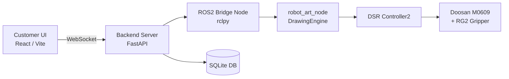

### 1-2. 플로우 차트 (Flow Chart)

<p align="center">
  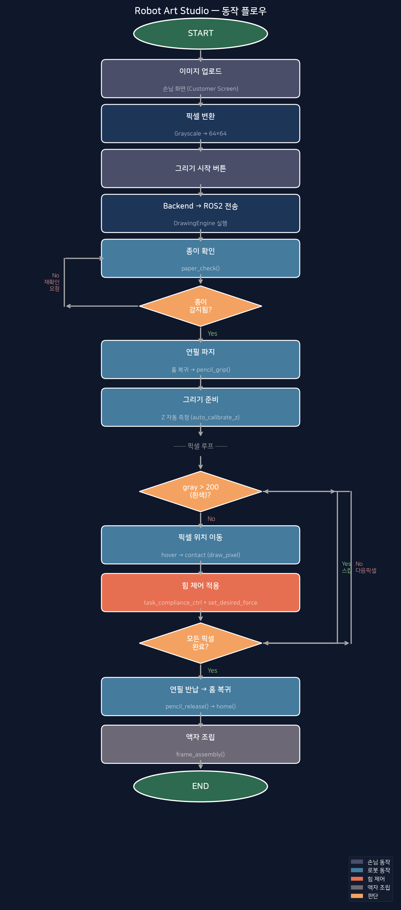
</p>

---

## 2. 🖥️ 운영체제 환경 (OS Environment)

<p>
  
  
  
  
  
</p>

| 항목 | 내용 |
|:---|:---|
| **OS** | Ubuntu 22.04 LTS |
| **ROS Version** | ROS2 Humble Hawksbill |
| **Language** | Python 3.10, TypeScript |
| **IDE** | VS Code |

> ⚠️ VM/Docker 사용 시 네트워크를 **Host 모드**로 설정해야 로봇과 정상 통신됩니다.

---

## 3. 🛠️ 사용 장비 목록 (Hardware List)

| 장비명 (Model) | 수량 | 비고 |
|:---:|:---:|:---|
| Doosan M0609 | 1 | 6축 협동로봇 |
| OnRobot RG2 | 1 | 전동 그리퍼 (Modbus TCP) |
| 일반 용지 (A5) | - | 그리기 매체 |
| 연필 | - | 드로잉 도구 |

---

## 4. 📦 의존성 (Dependencies)

### Backend (Python)
```
Python >= 3.10
fastapi
uvicorn
websockets
pymodbus
rclpy (ROS2 Humble)
```

### Frontend (Node.js)
```
Node.js >= 18
React 19
TypeScript
Vite
```

### ROS2 패키지
```
dsr_msgs2
dsr_hardware2
controller_manager
```

---

## 5. ▶️ 실행 순서 (Usage Guide)

### Step 1. ROS2 Workspace 빌드

```bash
cd ~/ws_cobot_pjt/ws_edu
colcon build --symlink-install
source install/setup.bash
```

### Step 2. 로봇 bringup (실제 로봇)

```bash
ros2 launch m0609_rg2_bringup bringup.launch.py mode:=real host:=192.168.1.100 model:=m0609
```

### Step 3. robot_art_node 실행

```bash
python3 ros2_node/robot_art_node.py
```

### Step 4. Backend 실행

```bash
cd backend
pip install -r requirements.txt
python main.py
```

### Step 5. Frontend 실행

```bash
cd frontend
npm install
npm run dev
```

---

## 6. 📸 Preview

### 손님 화면 (Customer Screen)

| 이미지 등록 | 이미지 크롭 |
| :---: | :---: |
|  |  |

| 이미지 편집 | 픽셀 편집 |
| :---: | :---: |
|  |  |

### 관리자 HMI

| 전체 동작 흐름 | 개별 동작 제어 |
| :---: | :---: |
| 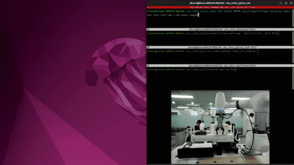 | 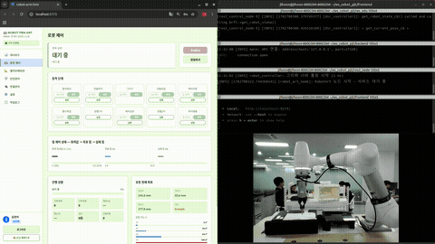 |

| 일시정지 / 재개 | 캘리브레이션 |
| :---: | :---: |
| 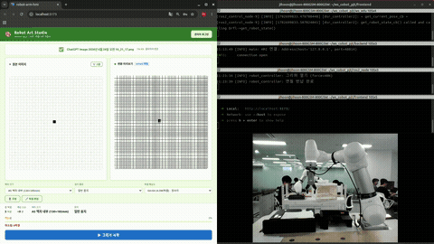 | 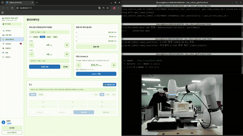 |

| 통신 연결 상태 |
| :---: |
| 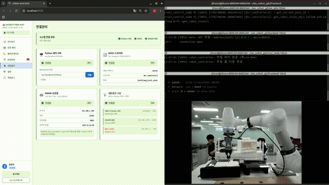 |

---

## 7. 🖼 결과물

| Pikachu | Mario |
| :---: | :---: |
| 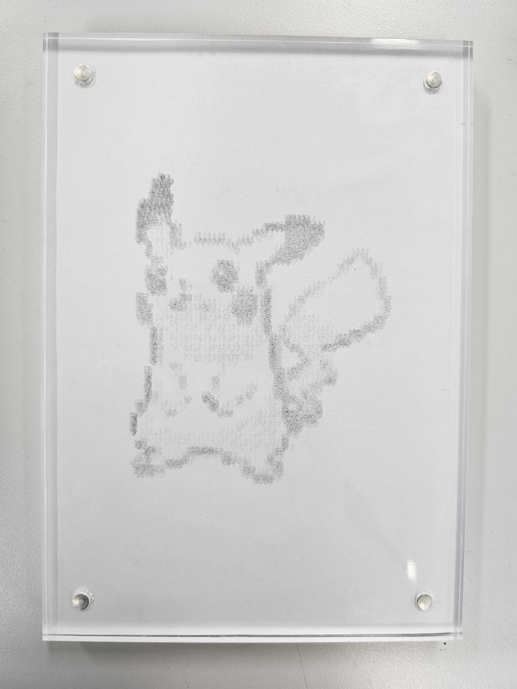 | 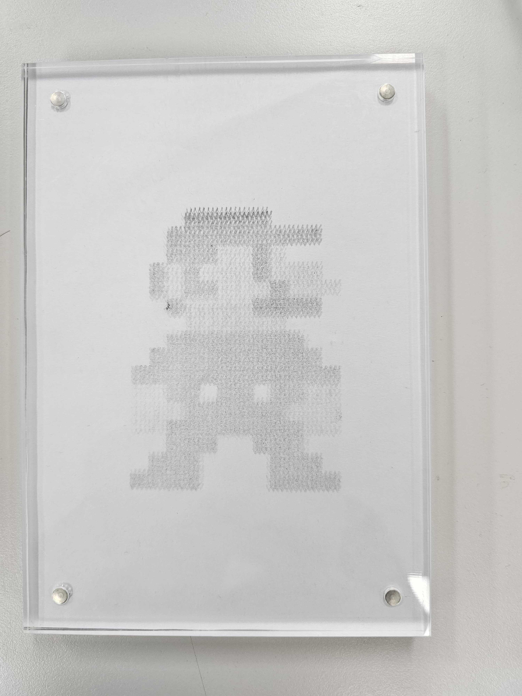 |

| Starry Night | Photo Style |
| :---: | :---: |
| 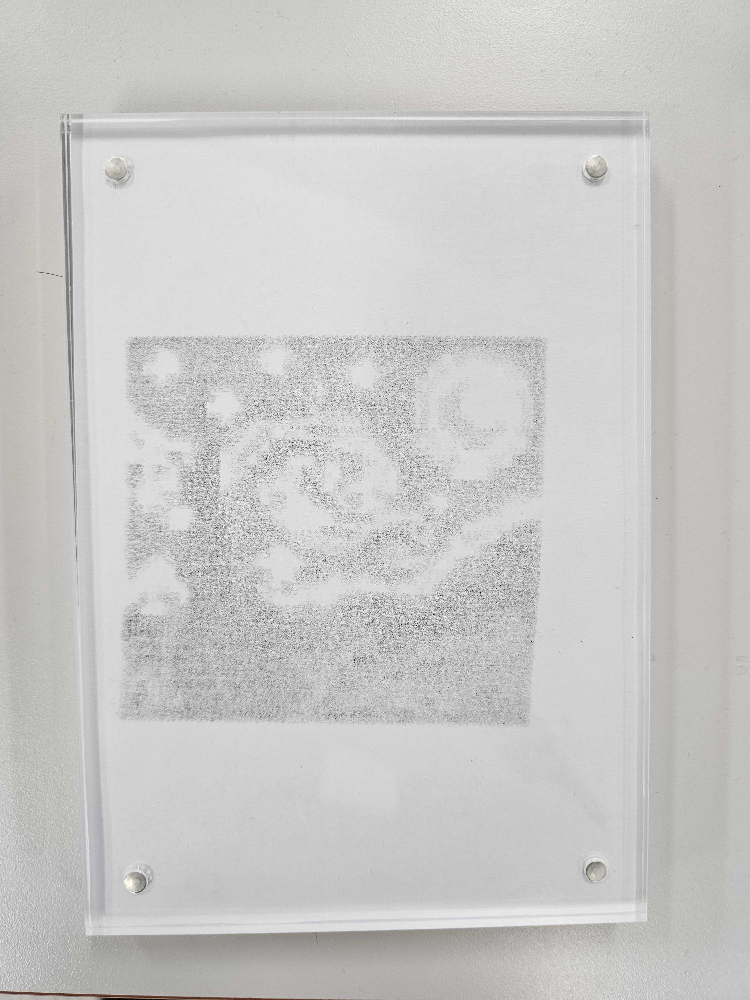 | 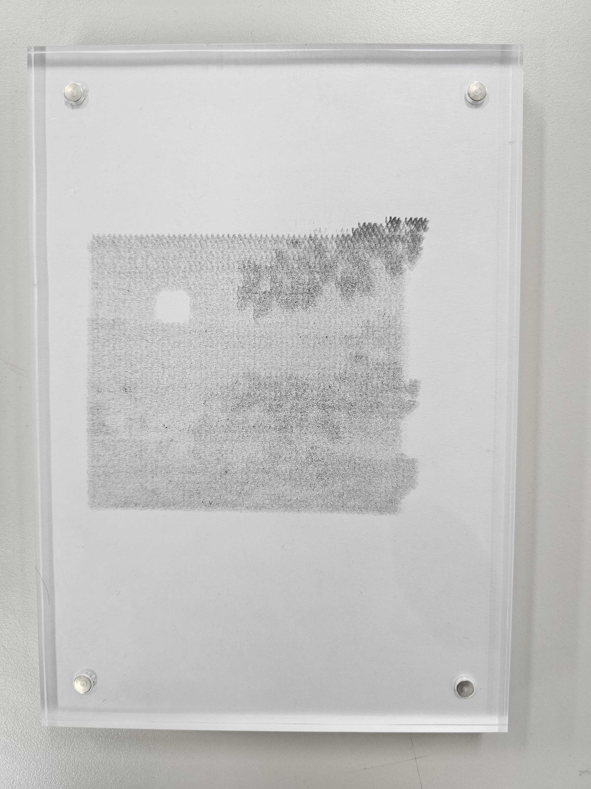 |

---

## 8. 🔌 ROS2 Communication

| Service | Description |
| --- | --- |
| `/robot_art/start` | 드로잉 시작 |
| `/robot_art/stop` | 작업 정지 |
| `/robot_art/estop` | 비상 정지 |
| `/robot_art/release_estop` | 비상 정지 해제 |
| `/robot_art/home` | 홈 위치 복귀 |
| `/robot_art/pencil_grip` | 펜 파지 |
| `/robot_art/pencil_release` | 펜 반납 |

| Topic | Type | Description |
| --- | --- | --- |
| `/robot_art/pixels` | `std_msgs/String` | 픽셀 데이터 전달 |
| `/robot_art/status` | `std_msgs/String` | 로봇 상태 전달 |
| `/dsr01/msg/joint_state` | `Float64MultiArray` | 로봇 조인트 상태 |
| `/dsr01/msg/current_posx` | `Float64MultiArray` | TCP 위치 |
