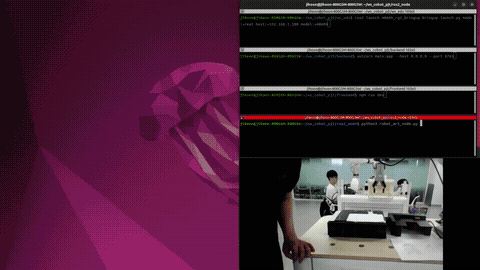
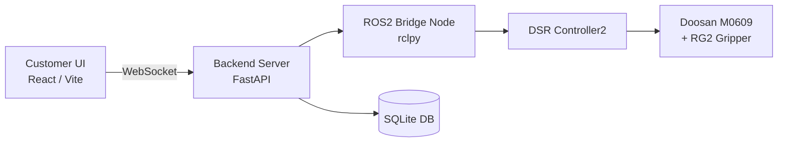

# 🤖 Robot Art Studio

> **Doosan M0609 협동로봇 기반 픽셀 점묘화 자동 출력 시스템**
> 이미지를 업로드하면 픽셀 아트로 변환하고, 로봇이 펜으로 한 점씩 찍어 작품을 완성합니다.

<p align="center">
  
</p>

<p align="center">
  
  
  
  
  
</p>

---

## ✨ 프로젝트 소개

**Robot Art Studio**는 사용자가 업로드한 이미지를 그레이스케일 픽셀 데이터로 변환한 뒤,
두산 **M0609 협동로봇**과 **RG2 그리퍼**를 이용해 종이에 점묘화 형태로 출력하는 시스템입니다.

고객용 화면에서는 이미지를 업로드하고 결과를 미리 볼 수 있으며,
관리자 HMI에서는 로봇 상태, 진행률, 힘 제어, 그리퍼, 캘리브레이션 등을 제어할 수 있습니다.

---

## 🧩 System Architecture



---

## 🛠 Tech Stack

| Part             | Tech                                 |
| ---------------- | ------------------------------------ |
| Frontend         | React 19, TypeScript, Vite           |
| Backend          | FastAPI, WebSocket, Python           |
| Robot Control    | ROS2 Humble, rclpy, DSR Controller2  |
| Hardware         | Doosan M0609, OnRobot RG2            |
| Image Processing | Canvas API / Pixel Conversion        |
| Database         | SQLite                               |

---

## 🚀 Main Features

### 🎨 Image to Pixel Art

* 업로드 이미지 그레이스케일 변환
* 설정 해상도(최대 64×64 등)에 맞춰 픽셀화
* 밝기 단계별 점묘화 데이터 생성 (gray ≤ 200 픽셀만 실제 작업)

### 🤖 Robot Drawing

* 픽셀 좌표 기반 로봇 경로 생성
* 펜 압력 / 접촉 시간 기반 명암 표현
* 흰색 영역 생략으로 작업 시간 단축

### 🖥 HMI Dashboard

* 고객용 이미지 업로드 화면
* 관리자용 로봇 제어 화면
* 진행률, 로그, 현재 좌표, 힘 센서 상태 표시

### 🛑 Safety Control

* E-STOP (서보 즉시 OFF + 하드웨어 토크 차단)
* 로봇 정지 / 재개
* 그리퍼 수동 제어
* 캘리브레이션 및 원점 복귀

### 🖼 액자 자동화

* 종이 픽업 → 정렬 → 그리기 → 액자 상/하판 조립 → 배출 전 자동화

---

## 📸 Preview

| Customer Screen | Admin Dashboard |
| --- | --- |
|  |  |

| Pixel Preview | Robot Drawing |
| --- | --- |
|  |  |

---

## 📁 Project Structure

```bash
A_2/
├── backend/
│   ├── main.py               # FastAPI WebSocket 서버 + ROS2 브릿지 노드
│   ├── robot_controller.py   # 로봇 동작 제어 (movej/movel/그리퍼/E-STOP 등)
│   ├── drawing_engine.py     # 드로잉 경로 생성 및 실행 스레드
│   ├── database.py           # SQLite DB (캘리브레이션, 설정, 작업 이력)
│   ├── config.py             # 로봇 IP, 속도, 그리퍼 등 전역 설정
│   └── requirements.txt
│
├── frontend/
│   └── src/
│       ├── App.tsx            # 메인 앱 (WebSocket 연결, 상태 관리)
│       ├── pages/
│       │   ├── CustomerScreen.tsx   # 고객용 이미지 업로드/미리보기
│       │   ├── DrawingControl.tsx   # 관리자 드로잉 단계 제어
│       │   ├── Safety.tsx           # E-STOP / 비상 해제
│       │   ├── Calibration.tsx      # 캘리브레이션
│       │   ├── Dashboard.tsx        # 상태 대시보드
│       │   ├── Gripper.tsx          # 그리퍼 수동 제어
│       │   └── Settings.tsx         # 속도/힘 설정
│       └── hooks/             # WebSocket 훅 등
│
├── ros2_node/
│   └── robot_art_node.py     # ROS2 서비스 서버 (start/stop/estop 등)
│
├── tools/
│   └── pixelart.py           # 이미지 픽셀 변환 유틸리티
│
├── ws_edu/
│   └── src/cobot_rg2/        # 두산 ROS2 패키지 (dsr_controller2 등)
│
├── ros2_communication.txt    # ROS2 토픽/서비스 전체 목록
└── README.md
```

---

## ⚙️ Installation & Run

### 1. ROS2 Workspace Build

```bash
cd ws_edu
colcon build --symlink-install
source install/setup.bash
```

### 2. Run Robot Bringup

```bash
ros2 launch dsr_bringup2 m0609_rg2_bringup.launch.py
```

### 3. Run Backend

```bash
cd backend
pip install -r requirements.txt
python main.py
```

### 4. Run Frontend

```bash
cd frontend
npm install
npm run dev
```

---

## 🔌 ROS2 Communication

자세한 전체 목록은 [`ros2_communication.txt`](ros2_communication.txt) 참고.

### Services (모두 `std_srvs/Trigger`)

| Service | Description |
| --- | --- |
| `/robot_art/start` | 드로잉 시작 |
| `/robot_art/stop` | 작업 정지 |
| `/robot_art/estop` | 비상 정지 |
| `/robot_art/release_estop` | 비상 정지 해제 |
| `/robot_art/home` | 홈 위치 복귀 |
| `/robot_art/pencil_grip` | 펜 파지 |
| `/robot_art/pencil_release` | 펜 반납 |
| `/robot_art/paper_check` | 종이 감지 확인 |
| `/robot_art/frame_task` | 액자 작업 전체 실행 |

### Topics

| Topic | Type | Description |
| --- | --- | --- |
| `/robot_art/pixels` | `std_msgs/String` | 픽셀 데이터 전달 |
| `/robot_art/status` | `std_msgs/String` | 로봇 상태 전달 |
| `/dsr01/msg/joint_state` | `Float64MultiArray` | 로봇 조인트 상태 |
| `/dsr01/msg/current_posx` | `Float64MultiArray` | TCP 위치 |

---

## 🎬 Demo Video

<p align="center">
  <!-- 유튜브 업로드 후 아래 VIDEO_ID 교체 -->
  <!-- <a href="https://www.youtube.com/watch?v=VIDEO_ID">
    
  </a> -->

  <!-- 또는 GitHub에 직접 업로드한 mp4 사용 시 -->
  <!-- <video src="./docs/videos/demo.mp4" width="720" controls></video> -->
</p>

---

## 🖼 Result

<p align="center">
  
</p>

---

## 👥 Team

**M0609 RG2 Pixel Art Printer Team**

| Role | Work |
| --- | --- |
| Robot Control | M0609 동작 제어, 그리퍼 제어, ROS2 연동 |
| Backend | FastAPI, WebSocket, 상태 관리 |
| Frontend | 고객 화면, 관리자 HMI |
| Image Processing | 픽셀 변환, 명암 단계 처리 |

---

## 📌 Future Improvements

* MoveIt 기반 경로 최적화
* 카메라 기반 종이 위치 보정
* 실시간 힘 제어 안정화
* CMY 컬러 점묘화 확장
* 작업 결과 자동 저장 및 히스토리 관리
