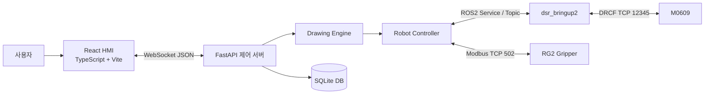
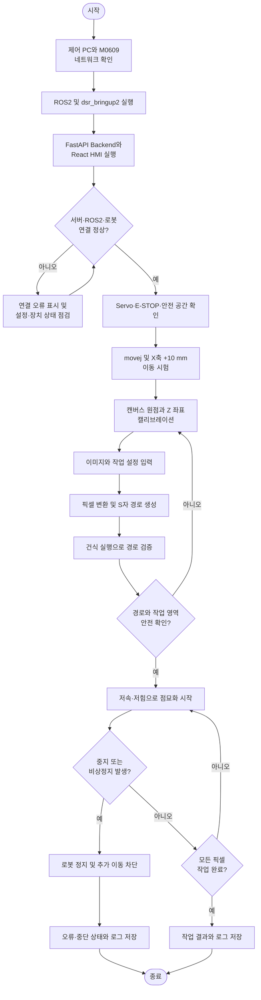

# 협동로봇 기반 픽셀 점묘화 시스템 프로젝트 기획서

## 1. 프로젝트 개요

### 1.1 프로젝트명

M0609 협동로봇과 RG2 그리퍼를 이용한 힘 제어 픽셀 점묘화 시스템

### 1.2 목적

사용자가 HMI에서 이미지를 등록하고 해상도, 용지 크기, 명암과 펜 압력을 설정하면 이미지를 로봇 좌표로 변환하여 M0609 협동로봇이 점묘화를 수행한다. 작업 상태와 로봇 상태를 실시간으로 표시하고 작업 결과, 오류, 캘리브레이션 정보를 저장한다.

### 1.3 주요 기능

- 이미지 업로드 및 밝기·대비·회전·반전 편집
- 이미지 픽셀 데이터와 회색조 단계 생성
- 회색조에 따른 펜 접촉력 결정
- 픽셀 좌표를 로봇 TCP 좌표로 변환
- S자 경로 기반 점묘화 수행
- 작업 시작·정지·일시정지·비상정지 및 원점 복귀
- M0609, ROS2, Python 서버 연결 상태 실시간 표시
- 캘리브레이션, 작업 이력, 로그 및 설정 저장

## 2. 시스템 아키텍처

### 2.1 구성 요소

| 구분 | 기술/장치 | 역할 |
|---|---|---|
| Frontend | React, TypeScript, Vite | 사용자 화면, 이미지 처리, 상태 표시 |
| Backend | Python, FastAPI, WebSocket | 명령 처리, 상태 중계, 작업 관리 |
| ROS2 | Humble, DSR_ROBOT2, dsr_bringup2 | M0609 모션 및 상태 인터페이스 |movej랑 x 10mm 이동하는거 지워줄래
| Robot | Doosan M0609 | 관절·직선 이동 및 힘 제어 |
| Gripper | OnRobot RG2 | 펜/도구 파지 |
| Database | SQLite | 작업, 로그, 설정, 캘리브레이션 저장 |

## 3. 요구사항

### 3.1 SYS (System Requirement)

| ID | 요구사항 | 중요도 | 상태 |
|---|---|---:|---|
| SYS-01 | 사용자는 HMI에서 이미지를 등록하고 점묘화 작업을 시작할 수 있어야 한다. | 높음 | 구현 |
| SYS-02 | 시스템은 이미지 픽셀을 로봇 작업 좌표로 변환하여 자동 경로를 생성해야 한다. | 높음 | 구현 |
| SYS-03 | 시스템은 로봇, ROS2, 서버의 연결 상태를 실시간으로 표시해야 한다. | 높음 | 구현 |
| SYS-04 | 비상정지 상태에서는 모든 이동 명령을 차단해야 한다. | 높음 | 구현 |
| SYS-05 | 실제 로봇 미연결 상태를 시뮬레이션 성공으로 표시하지 않아야 한다. | 높음 | 구현 |
| SYS-06 | 작업 결과와 오류 이력을 조회할 수 있어야 한다. | 중간 | 구현 |

### 3.2 HW (Hardware Requirement)

| ID | 요구사항 | 중요도 | 상태 |
|---|---|---:|---|
| HW-01 | 6축 Doosan M0609 협동로봇을 사용한다. | 높음 | 적용 |
| HW-02 | 펜 또는 도구 파지를 위해 OnRobot RG2 그리퍼를 사용한다. | 높음 | 적용 |
| HW-03 | 로봇과 제어 PC는 동일한 제어 네트워크에서 통신해야 한다. | 높음 | 적용 |
| HW-04 | 작업 영역에는 비상정지 및 충돌 방지 수단이 있어야 한다. | 높음 | 확인 필요 |

### 3.3 SW (Software Requirement)

| ID | 요구사항 | 중요도 | 상태 |
|---|---|---:|---|
| SW-01 | HMI는 React와 TypeScript 기반으로 구현한다. | 중간 | 구현 |
| SW-02 | 제어 서버는 FastAPI 기반 WebSocket 서버로 구현한다. | 높음 | 구현 |
| SW-03 | 로봇 제어는 ROS2 Humble과 DSR_ROBOT2 API를 사용한다. | 높음 | 구현 |
| SW-04 | 이미지의 회색조를 8N, 6N, 4N, 2N의 접촉력으로 변환한다. | 높음 | 구현 |
| SW-05 | 흰색에 가까운 픽셀은 경로에서 제외하여 작업 시간을 단축한다. | 중간 | 구현 |

### 3.4 COM (Communication Requirement)

| ID | 요구사항 | 중요도 | 상태 |
|---|---|---:|---|
| COM-01 | HMI와 Python 서버는 WebSocket JSON 메시지로 통신해야 한다. | 높음 | 구현 |
| COM-02 | Python 서버와 로봇 드라이버는 ROS2 Topic/Service로 통신해야 한다. | 높음 | 구현 |
| COM-03 | RG2 그리퍼는 Modbus TCP로 제어해야 한다. | 높음 | 구현 |
| COM-04 | 연결이 끊긴 HMI는 3초 간격으로 서버 재연결을 시도해야 한다. | 중간 | 구현 |

### 3.5 DB (Database Requirement)

| ID | 요구사항 | 중요도 | 상태 |
|---|---|---:|---|
| DB-01 | 작업명, 해상도, 픽셀 수, 상태, 시작·종료 시간을 저장해야 한다. | 중간 | 구현 |
| DB-02 | 시스템 로그를 레벨 및 작업 ID와 함께 저장해야 한다. | 중간 | 구현 |
| DB-03 | 캔버스 원점, Z 좌표, 픽셀 간격 등의 캘리브레이션을 저장해야 한다. | 높음 | 구현 |
| DB-04 | 이동 속도, 그리기 속도, 임계값 등의 설정을 저장해야 한다. | 중간 | 구현 |

### 3.6 OPS (Operation Requirement)

| ID | 요구사항 | 중요도 | 상태 |
|---|---|---:|---|
| OPS-01 | 실제 운전 전 로봇 연결과 캘리브레이션 상태를 확인해야 한다. | 높음 | 절차 필요 |
| OPS-02 | 사용자는 작업을 중단하거나 비상정지할 수 있어야 한다. | 높음 | 구현 |
| OPS-03 | 관리자는 원점 복귀와 작업 상태 확인을 수행할 수 있어야 한다. | 높음 | 구현 |
| OPS-04 | 건식 실행 모드에서는 실제 로봇 이동 없이 경로를 검증해야 한다. | 중간 | 구현 |

### 3.7 MAINT (Maintenance Requirement)

| ID | 요구사항 | 중요도 | 상태 |
|---|---|---:|---|
| MAINT-01 | 로봇 IP, 속도, 힘, 캘리브레이션 값을 설정 파일 또는 DB에서 변경할 수 있어야 한다. | 중간 | 구현 |
| MAINT-02 | 오류 발생 시 HMI와 서버 로그에서 원인을 확인할 수 있어야 한다. | 높음 | 구현 |
| MAINT-03 | 실제 로봇 연결 실패 시 명확한 오류를 출력해야 한다. | 높음 | 구현 |

## 4. ROS2 인터페이스 요구사항

### 4.1 노드

| ID | 노드 | 역할 |
|---|---|---|
| ROS-01 | `/dsr01/robot_art_controller` | DSR_ROBOT2 서비스 클라이언트 및 로봇 명령 실행 |
| ROS-02 | `robot_art_sub` | 관절각과 TCP 위치 토픽 구독 |
| ROS-03 | dsr_bringup2 관련 노드 | 실제 M0609 하드웨어 인터페이스 제공 |

### 4.2 토픽

| ID | 토픽 | 방향 | 용도 |
|---|---|---|---|
| ROS-04 | `/dsr01/msg/joint_state` | Robot → Backend | 6축 관절각 수신 |
| ROS-05 | `/dsr01/msg/current_posx` | Robot → Backend | TCP 위치 수신 |

### 4.3 서비스

| ID | 서비스 | 용도 |
|---|---|---|
| ROS-06 | `/dsr01/motion/move_joint` | `movej` 관절 이동 |
| ROS-07 | `/dsr01/motion/move_line` | `movel` 직선 및 상대 이동 |
| ROS-08 | `/dsr01/motion/move_home` | 원점 복귀 |
| ROS-09 | `/dsr01/motion/move_stop` | 비상정지 및 이동 중단 |

## 5. 인터페이스 요구사항

| ID | 인터페이스 | 데이터/기능 |
|---|---|---|
| IF-01 | Frontend ↔ Backend | WebSocket, 작업 명령과 상태 JSON |
| IF-02 | Backend ↔ ROS2 | DSR_ROBOT2 Topic/Service |
| IF-03 | ROS2 ↔ M0609 | DRCF, `192.168.1.100:12345` |
| IF-04 | Backend ↔ RG2 | Modbus TCP, `192.168.1.1:502` |
| IF-05 | Backend ↔ SQLite | 작업·로그·설정·캘리브레이션 CRUD |

## 6. 주요 WebSocket 명령

| 명령 | 기능 |
|---|---|
| `start_drawing` | 이미지 픽셀과 설정을 전달하여 작업 시작 |
| `stop` | 작업 중단 |
| `pause`, `resume` | 작업 일시정지·재개 메시지(Backend 실제 처리 연동 예정) |
| `estop`, `reset_estop` | 비상정지 설정 및 해제 |
| `home` | 로봇 원점 복귀 |
| `gripper_open`, `gripper_close` | RG2 그리퍼 제어 |
| `get_status` | 로봇 및 작업 상태 조회 |
| `test_movej` | 준비 관절 자세 이동 시험 |
| `test_movel_rel_x` | TCP 기준 X축 +10 mm 상대 이동 시험 |

## 7. 테스트 요구사항

### 7.1 TC (Test Case)

| ID | 시험 항목 | 사전 조건 | 기대 결과 |
|---|---|---|---|
| TC-01 | 서버 연결 시험 | Backend 실행 | HMI에 Python 서버 연결 표시 |
| TC-02 | ROS2 연결 시험 | dsr_bringup2 실행 | ROS2와 M0609 연결 상태 표시 |
| TC-03 | `movej` 시험 | Servo ON, E-STOP 해제 | 로봇이 `[0,0,90,0,90,0]` 자세로 이동 |
| TC-04 | X축 상대 이동 시험 | 안전 작업공간 확보 | 현재 TCP에서 Base X 방향으로 +10 mm 이동 |
| TC-05 | 이미지 경로 생성 시험 | 이미지 및 캘리브레이션 등록 | 픽셀 좌표가 S자 로봇 경로로 변환 |
| TC-06 | 힘 매핑 시험 | 회색조 단계 입력 | 각 단계가 8/6/4/2 N으로 변환 |
| TC-07 | 비상정지 시험 | 로봇 이동 중 | 즉시 정지하고 추가 이동 명령 차단 |
| TC-08 | 연결 실패 시험 | ROS2 미실행 | 성공 로그 대신 실제 연결 실패 오류 표시 |
| TC-09 | DB 저장 시험 | 작업 1회 수행 | 작업 결과와 로그가 SQLite에 저장 |

### 7.2 VAL (Validation)

| ID | 검증 항목 | 합격 기준 |
|---|---|---|
| VAL-01 | 이미지 재현성 | 선택한 픽셀 패턴과 실제 점 위치가 허용 오차 이내 일치 |
| VAL-02 | 위치 정확도 | 기준점 대비 TCP 위치 오차가 프로젝트 허용 범위 이내 |
| VAL-03 | 힘 제어 안정성 | 목표 힘 단계가 안전 한계를 넘지 않고 반복 적용 |
| VAL-04 | 안전 기능 | E-STOP 후 모션이 정지하고 해제 전 재동작하지 않음 |
| VAL-05 | 상태 신뢰성 | 실제 ROS2 미연결 상태를 연결 완료로 표시하지 않음 |

## 8. Traceability Matrix

| Requirement ID | 설명 | 구현 모듈 | 관련 코드 | Test Case | 상태 |
|---|---|---|---|---|---|
| SYS-01 | 이미지 등록 및 작업 시작 | Frontend, Backend | `CustomerScreen.tsx`, `main.py` | TC-05 | 구현 |
| SYS-02 | 픽셀을 로봇 경로로 변환 | Drawing Engine | `_build_path()` | TC-05 | 구현 |
| SYS-03 | 연결 상태 실시간 표시 | Frontend, Backend | `Connection.tsx`, `get_state()` | TC-01, TC-02 | 구현 |
| SYS-04 | E-STOP 시 이동 차단 | Robot Controller | `emergency_stop()`, `movej()`, `movel()` | TC-07 | 구현 |
| SYS-05 | 시뮬레이션 오판 방지 | Backend, Frontend | `ensure_real_connection()`, `ros2` 상태 | TC-08 | 구현 |
| SW-04 | 회색조별 접촉력 변환 | Drawing Engine | `_gray_to_force()` | TC-06 | 구현 |
| COM-01 | WebSocket 통신 | Frontend, Backend | `useRobotServer.ts`, `/ws` | TC-01 | 구현 |
| COM-02 | ROS2 통신 | Robot Controller | `_init_dsr()`, `DSR_ROBOT2` | TC-02~04 | 구현 |
| DB-01 | 작업 이력 저장 | Database | `create_job()`, `finish_job()` | TC-09 | 구현 |
| DB-03 | 캘리브레이션 저장 | Database | `save_calibration()` | TC-05 | 구현 |
| ROS-06 | 관절 이동 서비스 | Robot Controller | `movej()` | TC-03 | 구현 |
| ROS-07 | 직선 이동 서비스 | Robot Controller | `movel()`, `movel_relative()` | TC-04 | 구현 |

## 9. 실행 및 검증 순서

### 9.1 작업 순서도

### 9.2 실행 절차

1. 제어 PC와 M0609의 네트워크 연결 및 IP를 확인한다.
2. ROS2 Humble과 Doosan 워크스페이스 환경을 source한다.
3. `dsr_bringup2`를 real 모드로 실행한다.
4. FastAPI 백엔드를 실행한다.
5. React HMI를 실행하고 세 연결 상태가 정상인지 확인한다.
6. 안전 공간을 확보한 뒤 `movej`와 X축 +10 mm 시험을 수행한다.
7. 캘리브레이션 후 건식 실행으로 경로를 검증한다.
8. 저속·저힘 조건에서 실제 점묘화 시험을 진행한다.

## 10. 향후 보완 항목

- 실제 TCP 위치 오차와 힘 제어 반복성에 대한 정량 합격 기준 확정
- 로봇 보호정지, Servo OFF, 안전문 상태의 HMI 표시
- WebSocket `pause/resume`의 실제 로봇 모션 정지·재개 연동
- 통합 테스트 결과와 사진을 각 TC 항목에 첨부
- 캘리브레이션 좌표의 작업 영역 초과 여부 검사
